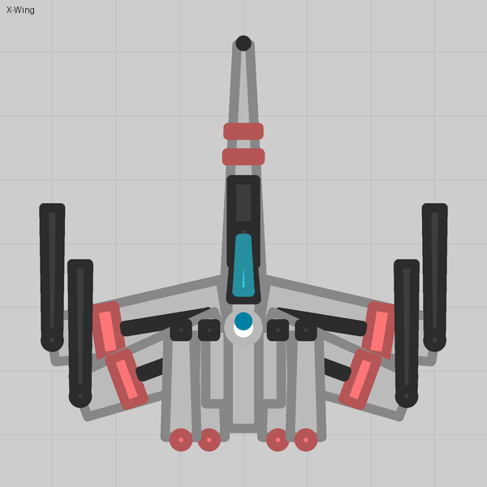

# diep-pack

An [Agent Skill](https://agentskills.io) that turns a plain-English description into a custom
pack for the **diep.io sandbox editor**: tanks, and the arena shapes they fight over. Describe
a tank or a theme; the skill designs it, writes the `.diep-pack` file, validates it against a
reverse-engineered spec of the format, renders it the way the editor draws it, looks at the
render, and tells you what to try in game.



> "an X-Wing with four wingtip lasers that converge on the cursor, a proton torpedo on right
> click, and an astromech that watches the nearest enemy"

The pack that prompt produced is in [`examples/x-wing/`](examples/x-wing/): the design script,
the `.diep-pack` it builds, and the PNG and SVG renders.

## Get it

No coding. The skill is one small zip that you hand to the AI you already use; after that you
ask for tanks in plain English and get files back.

**1. Download [`diep-pack.zip`](https://github.com/RedNebulaSunshine/diep-pack-skill/releases/latest/download/diep-pack.zip).**
Keep it zipped. (Use this link, not GitHub's green *Code → Download ZIP* button: that one names
the folder inside differently and the upload is refused.)

**2. Give it to your AI.**

<details open>
<summary><b>Claude</b> (claude.ai or the Claude desktop app; a free account is enough)</summary>

1. **Settings → Capabilities**: make sure **Code execution** is switched on. The skill needs it
   to check and draw your tanks.
2. **Customize → Skills → +** (or *Create skill*) **→ Upload a skill**, and pick `diep-pack.zip`.
   `diep-pack` appears in your list of skills, switched on.
3. Open a **new chat** and type, for example:

   > Use the diep-pack skill: a crab whose right claw fires a heavy shell on left click and the
   > left claw on right click.

Claude will pitch the tank's moves, ask you a couple of quick questions (level, parent tank,
your author name), then give you the `.diep-pack` as a download with a picture of the tank.
If you also use Claude Code signed in with the same account, the skill is already there.
</details>

<details open>
<summary><b>ChatGPT</b></summary>

- **Business, Enterprise or Edu account:** **Skills → Create → Upload from your computer**, pick
  `diep-pack.zip`, wait for the scan to finish. Then in a chat: *"Use the diep-pack skill: a
  hen followed by her chicks that lays eggs on right click."*
- **Free, Go, Plus or Pro account:** personal plans do not have Skills yet (October 2026), so
  give ChatGPT the zip yourself. Make a **Project** called *Diep tanks*, add `diep-pack.zip` to
  its files, and paste this into the project's **Instructions**:

  > `diep-pack.zip` in this project is a skill. At the start of every chat, unzip it with Python,
  > read `diep-pack/SKILL.md` and follow it step by step, running its scripts from the unzipped
  > folder. Give me every `.diep-pack` file and every picture it makes as a download.

  Every chat inside that project then knows the skill. (In a hurry? Attach the zip to a single
  chat and paste the same text as your first message.) ChatGPT's sandbox has no internet, so
  the skill's own update check prints `NOT CHECKED`; that is fine.
</details>

<details>
<summary><b>Claude Code, Codex, Cursor, Gemini CLI and other terminals</b></summary>

```
git clone https://github.com/RedNebulaSunshine/diep-pack-skill ~/.claude/skills/diep-pack
```

or clone it into a project's `.claude/skills/diep-pack` to scope it to that project. Then:

```
/diep-pack a hexagonal smasher that fades when still, spikes spinning fast
```

Other agents: point the agent at `SKILL.md` or copy the folder to wherever that agent looks
for skills (Codex: `.agents/skills/diep-pack`). Nothing in the skill depends on a particular
host. On your own machine you need Python 3.8 or newer and, for PNG renders,
[Pillow](https://pypi.org/project/Pillow/) (`pip install -r requirements.txt`; without it the
renderer still writes SVG). A git clone updates itself with your OK (see *Updates* below).
</details>

**3. Ask for a tank.** Anything goes: a stock-style weapon tank ("a Sniper with two alternating
barrels and three swarm drones out the back"), a creature or vehicle ("a dragonfly whose
mandibles are the guns"), a character ("Luke Skywalker", "a firefighter") or a whole themed
arena ("arena shapes for a desert pack"). The skill works out what the subject should *do*,
pitches it, and builds it once you pick.

**4. Put it in the game.** Open the diep.io sandbox editor: **Import**, choose the `.diep-pack`
file you downloaded, **add to this pack**. Your tank is in the upgrade tree at the level and
parent you chose. More in [Importing a pack](#importing-a-pack).

**If something does not work**

- *Claude says it has no such skill:* check **Customize → Skills** shows `diep-pack` switched
  on, and start a new chat; skills are picked up when a chat begins.
- *The upload is refused:* the zip must hold one folder named `diep-pack` with `SKILL.md`
  inside it. The download link above is built that way; a zip you made yourself may not be.
- *You get a file path instead of a file:* say "give me the file as a download". (Fixed in
  1.3.1; an older copy of the skill may still do it.)
- *The game refuses the pack:* import it from the file, not pasted text; long pasted lines get
  mangled. If it still refuses, tell the skill what the editor said.

**Updates.** Once a day at most, at the start of a session, the skill checks whether a newer
version is published and, if so, tells you what it adds ([`CHANGELOG.md`](CHANGELOG.md)) and
how to update. A `git clone` updates itself with your OK (a fast-forward; local edits are
never touched); a zip install downloads the new zip from the link above and replaces the old
skill with it (on claude.ai or ChatGPT: remove the old `diep-pack` skill, upload the new zip).
The check fetches this repository's `SKILL.md` and `CHANGELOG.md` and sends nothing about you
or your work. To turn it off, set `DIEP_PACK_NO_UPDATE_CHECK=1`; to check by hand, run
`python scripts/check_update.py --force`.

## What it can do

- Weapon tanks from every stock mechanic: alternating and ring cannons, snipers, destroyers,
  drones and swarms, necromancers, missiles, minions, trappers, smashers, stealth, auto
  turrets, shotguns, bursts, right-click modes, scopes.
- Figurative tanks that look like something (a dragonfly, a crab, a snake, a starship, a
  crocodile) built from up to 32 body shapes and 32 barrels, using the tricks players have
  discovered: parts that pump like pistons, pendulum tails, jaws and hands that follow the
  cursor, eyes that watch enemies, a body that trails behind the tank, faces painted on the hull.
- Themed arenas: the map's shapes replaced by the theme's own food, crashers that hunt,
  walls that never budge, rare prizes and bosses, laid out in square rings from the edge to the
  centre, with each shape's share of the spawns predicted before you import.
- Upgrade-tree placement (level and parent tanks), multi-tank lines, total conversions.
- Edit mode: change an existing pack without disturbing the rest.

## How it works

| Piece | What it is |
|---|---|
| `SKILL.md` | The workflow the agent follows: load only the references it needs, work out the subject's signature moves, pitch them with level / parent / author in one question, build, validate, render, look, deliver. |
| `references/quick-reference.md` | Every field on one page with default, unit and confidence. |
| `references/schema/` | The full reverse-engineered spec of the `.diep-pack` format, one file per family, every field tagged Confirmed / High / Medium / Low with how it was established. Diep.io publishes no documentation for this format. |
| `references/moves.md` | From a subject to what the tank does: the method, a catalogue of verbs (swing a blade, leap, snare, summon, place…) mapped to mechanics, and worked pitches (Luke Skywalker, a hen, Thor, a pirate ship, a toaster). |
| `references/arena.md` | From a theme to the arena's shapes: the method, roles with their numbers (food, prize, hazard, wall, boss…), the ring layout and spawn weights. |
| `references/recipes.md` | How each stock mechanic is written, with the real stock tanks' numbers. |
| `references/vanilla-tanks.md` | Every vanilla tank's id, level and parents, and which ids the engine rejects. |
| `references/figurative.md` | Building a subject out of parts: primitives, the silhouette-first workflow, the motion map (what can move and how), lessons from player-built packs. |
| `scripts/validate_pack.py` | Standard-library validator: unknown keys, bad references, the editor's import limits (counts, clamps, the three-collidable rule), and the lobby's import budget, ported from the editor's own check. `--summary` prints what the pack says. |
| `scripts/render_pack.py` | Renders a pack the way the editor draws it (PNG, `--svg`, `--sheet`), verified to within a pixel against every stock tank and hundreds of player-built ones. |
| `scripts/ref.py` | Prints only the sections of the references a design needs (`ref.py recipes intro 5 25`, `ref.py spec 7a`, `ref.py --find keepDistance`) and the build library's calls without its source (`ref.py api`), so the agent loads a few thousand tokens instead of tens of thousands. |
| `scripts/check_update.py` | The once-a-day check for a newer published version: what is new, and `--apply` to fast-forward a git clone. |
| `scripts/skill_meta.py` | Reads the skill's version and repository from `SKILL.md`'s `metadata`, the one place the repository's address is written, so moving the repository is a one-line change. |
| `scripts/report_issue.py` | Turns a finding into a GitHub issue the user files themselves: strips paths, names, keys and other private details, then prints a link that opens the issue form filled in (`references/feedback.md`). |
| `scripts/compose.py`, `scripts/mechanics.py` | A build library for figurative designs: rods, chains, jointed limbs, fans, mirrors, frames, and every stock mechanic as a one-call preset. `save()` writes, validates and renders. |
| `assets/archetypes/` | Design scripts to copy from: dragonfly, crab, spider, starship, serpent, croc, a face on the hull. |
| `examples/x-wing/` | A complete worked example with its outputs. |
| `evals/evals.json` | Plain requests ("Luke Skywalker", "a hen") with what a good answer must propose unprompted: run them after changing `SKILL.md` or `moves.md`. |
| `.github/workflows/release.yml` | Builds `diep-pack.zip` and publishes a GitHub release whenever the version in `SKILL.md` changes on `main`. |

Packs and renders are written to `./output/` in the directory the agent runs from
(set `DIEP_PACK_OUT` to change that). In a chat host (claude.ai, ChatGPT) the skill hands them
over as downloads.

To try the tooling without an agent:

```
python scripts/validate_pack.py examples/x-wing/x-wing.diep-pack --summary
python scripts/render_pack.py examples/x-wing/x-wing.diep-pack --svg
python examples/x-wing/x-wing.py
```

## Importing a pack

In the sandbox editor: **Import**, choose the `.diep-pack` file, **add to this pack**. Prefer
importing from a file over pasting; long pasted lines get mangled. Tank ids are reassigned on
import, so a pack cannot link into another pack's tree.

## Limits worth knowing

- 32 body shapes, 32 barrels and 8 turrets per tank; the editor drops the rest without a
  warning, and keeps only three collidable parts per tank and per projectile.
- The game refuses a tank over its import budget (120 entities a second, 250 alive, and four
  more limits); the validator carries the editor's own copy of that check.
- Turrets cannot be mounted on turrets, so a jointed chain that bends is impossible.
- A few defaults are still unmeasured; the spec's §13 lists them and the skill names any
  guess it relies on.

## Contributing

Findings from in-game tests and new techniques are the most valuable contributions. When you
tell the skill that something behaved differently in game, or the two of you find a new way of
doing something (a move, a drawing trick, a faster way to test), it offers to draft an issue for
this repository. It writes up the finding or the technique (not you or your pack), removes
anything private, and gives you a link that opens the issue already filled in. You check it and
press Submit; the skill sends nothing itself. You can also open an issue by hand with the
**Skill finding or discovery** form. Issues are read by the maintainer before anything
changes; please do not open pull requests for findings, open an issue instead.

## Licence and credits

MIT licence, see [LICENSE](LICENSE). Diep.io, its tank designs and the sandbox pack format
belong to the game's publisher; this project documents the format and generates files for
it and is not affiliated with them. The spec was built from the editor's own exports and from
in-game tests, and learned a great deal from six packs built by other players (326 tanks)
that are not redistributed here.
